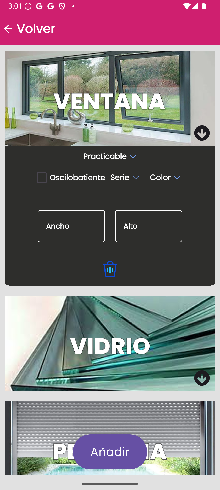
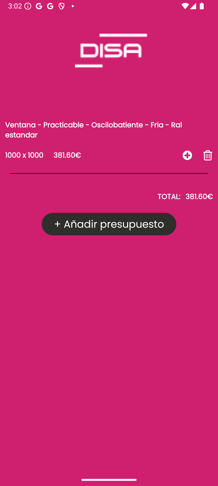

# Presupuestos Disa

Aplicación móvil para la gestión de presupuestos en Aluminis Disa.

## Descripción

Esta aplicación permite a los usuarios gestionar presupuestos de manera eficiente, proporcionando una interfaz intuitiva y fácil de usar.

## Características

- Creación y edición de presupuestos

## Capturas de Pantalla

### SplashScreen

### Pantalla Principal

### Lista de Productos

### Lista de Presupuestos

## Uso

1. Inicia la aplicación.
2. Navega por las diferentes secciones para gestionar tus presupuestos.

## Licencia

**No autorizo su distribución ni uso sin permiso. Para más detalles, consulta el archivo [LICENSE.md](./LICENSE.md)**